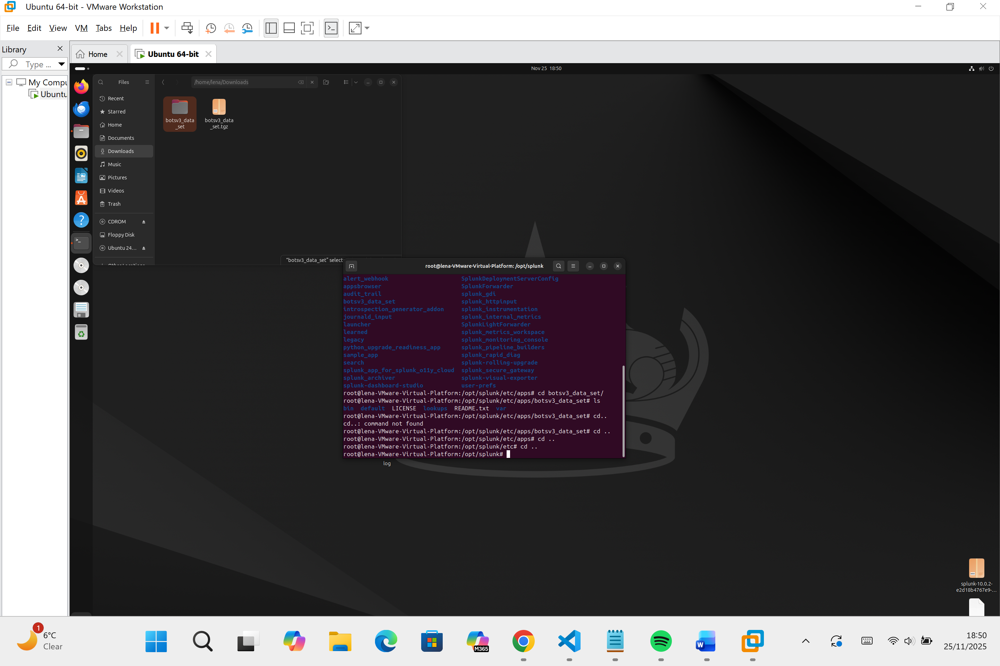
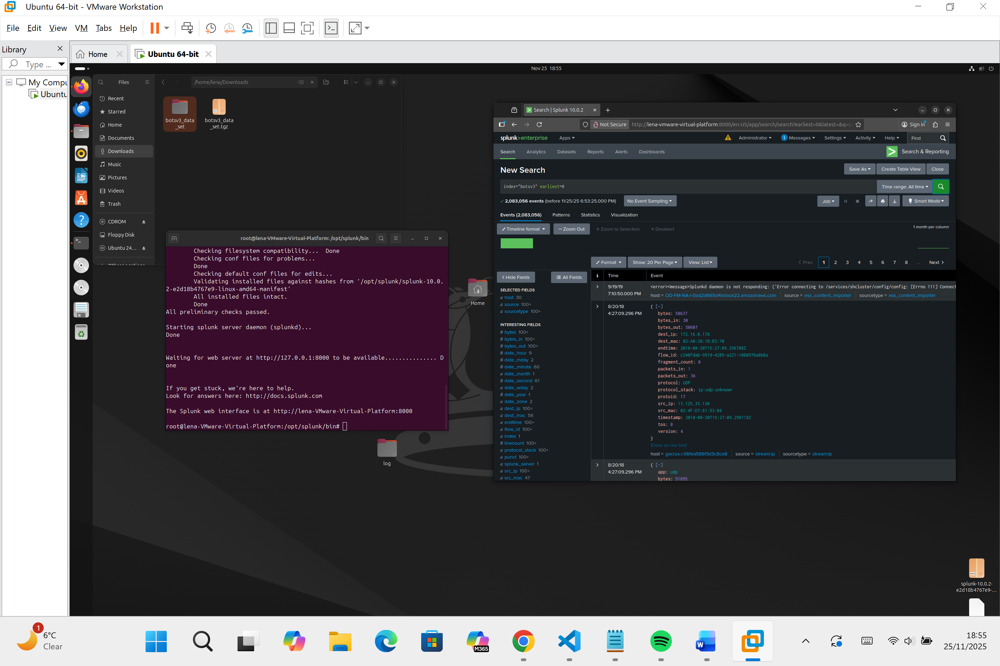

# COMP3010CW2
BOTSv3 Incident Analysis and Presentation

Introduction:

Security Operations Centres which can be defined as a centralized unit that deals with security issues on an organisational level plus a team primariliy composed of security analysts organized to detect, analyze, respond to, report on and prevent IS (Information Security) incidents. [1] SOC teams rely on Security Informationa dn Event Management (SIEM) platforma like Splunk which can enable analysts to gather security logs, search through them and identify connections and suspicious patterns. 

In regards to this, the BOTSv3

SOC roles and incident handling reflection:

Installation and data preparation:

I have set up splunk the way shown in the video and i have downloaded and uploaded the BotsV3 dataset into splunk on my virtual machine:

Guided Questions:

Q1:
Search for 

Conclusion, references and presentation

[1]N. Miloslavskaya, “Security Operations Centers for Information Security Incident Management,” 2016 IEEE 4th International Conference on Future Internet of Things and Cloud (FiCloud), Aug. 2016, doi: https://doi.org/10.1109/ficloud.2016.26.
‌